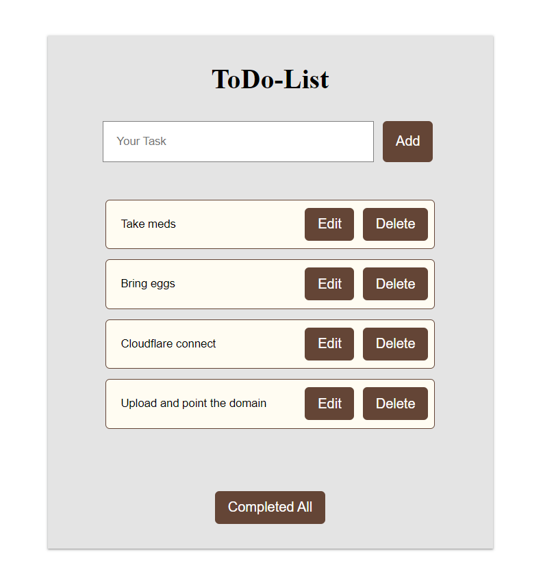

# Todo App 

A simple To-Do web application built with ReactJs. It allows users to create task list for managing day to day tasks.

## Demo (Visit: https://todo-by-shweta.vercel.app/)

## Features -

* Create task list as many as you want.
* Users can edit and delete as per requirements.
* Data gets locally saved.

## Installation guide - 

1. Clone the repo
2. Cd into the root directory
3. Install node modules using `npm install` command
4. Start the server using `npm run dev`

 

